# 💼 Application de Gestion de Portefeuille OPCVM

Une application web Java EE développée dans le cadre d'un stage de 2ème année de DUT Informatique pour la gestion des portefeuilles d'investissement OPCVM (Organismes de Placement Collectif en Valeurs Mobilières).

## 🎯 Objectif du Projet

Cette application permet aux gestionnaires financiers de gérer efficacement leurs portefeuilles OPCVM, de suivre les transactions des clients, d'analyser les performances des investissements et de générer des rapports détaillés.

## 📈 Fonctionnalités Principales

### 💳 Gestion des Clients
- Enregistrement des clients (personnes physiques et morales)
- Gestion des informations personnelles et juridiques
- Suivi des transactions par client
- Consultation du portefeuille client

### 📊 Gestion des Portefeuilles
- Création et configuration des portefeuilles OPCVM
- Classification par type (Actions, Obligataire, Monétaire, Diversifiés)
- Définition des objectifs et horizons d'investissement
- Gestion des profils de risque

### 🏢 Gestion des Sociétés de Gestion
- Référentiel des sociétés de gestion
- Informations de contact et coordonnées
- Association avec les portefeuilles gérés

### 💰 Gestion des Transactions
- Enregistrement des opérations d'achat/vente
- Calcul automatique des montants
- Suivi des parts et valeurs liquidatives
- Historique complet des transactions

### 📉 Gestion des Cours (Valeurs Liquidatives)
- Saisie des cours quotidiens
- Historique des évolutions
- Calculs de performance

### 📊 Analyses et Reporting
- Graphiques de performance des portefeuilles
- Évolution des valeurs liquidatives
- Export des données (Excel)
- Tableaux de bord dynamiques

## 🛠️ Technologies Utilisées

### Backend
- **Framework**: Java EE (JSF 2.3, CDI)
- **ORM**: Hibernate 5.x
- **Base de données**: Compatible JPA (MySQL, PostgreSQL, etc.)
- **Interface utilisateur**: PrimeFaces 10.x
- **Templating**: Facelets (XHTML)

### Frontend
- **Framework CSS**: PrimeFlex pour la mise en page
- **Composants UI**: PrimeFaces avec thèmes personnalisés
- **Graphiques**: PrimeFaces Charts (intégration Chart.js)
- **Icons**: PrimeIcons

### Architecture
- **Pattern MVC**: Managed Beans JSF + Services + Entities JPA
- **Injection de dépendances**: CDI (Contexts and Dependency Injection)
- **Gestion des sessions**: Session-scoped beans
- **Validation**: Bean Validation (JSR-303)

## 🏗️ Architecture du Projet

```
portfeuille_opcvm/
├── src/main/java/
│   ├── beans/           # Managed Beans JSF (Couche Présentation)
│   ├── entities/        # Entités JPA (Couche Données)
│   ├── services/        # Services métier (Couche Business)
│   └── utils/           # Utilitaires (Configuration Hibernate)
├── src/main/webapp/
│   ├── clients/         # Pages de gestion des clients
│   ├── portefeuilles/   # Pages de gestion des portefeuilles
│   ├── resources/       # Ressources statiques (CSS, JS, images)
│   └── WEB-INF/         # Configuration web
└── README.md
```

## 📋 Prérequis

- **Java**: JDK 8 ou supérieur
- **Serveur d'application**: WildFly, GlassFish, ou Tomcat + TomEE
- **Base de données**: MySQL, PostgreSQL ou autre SGBD compatible JPA
- **Maven**: 3.6+ pour la gestion des dépendances
- **IDE**: Eclipse, IntelliJ IDEA ou NetBeans

## 🚀 Installation et Déploiement

### 1. Cloner le projet
```bash
git clone https://github.com/votre-username/portfeuille-opcvm.git
cd portfeuille-opcvm
```

### 2. Configuration de la base de données
- Créer une base de données MySQL/PostgreSQL
- Configurer les paramètres de connexion dans `persistence.xml`
- Les tables seront créées automatiquement via Hibernate

### 3. Compilation et packaging
```bash
mvn clean compile
mvn package
```

### 4. Déploiement
- Déployer le fichier WAR généré sur votre serveur d'application
- Ou utiliser un serveur embarqué pour le développement

### 5. Accès à l'application
```
http://localhost:8080/portfeuille_opcvm
```

## 🎓 Contexte Pédagogique

Ce projet a été développé dans le cadre d'un **stage de 2ème année de DUT Informatique**, permettant de :

### Compétences Développées
- **Développement Java EE** : Maîtrise du framework JSF et des technologies associées
- **Conception de bases de données** : Modélisation et implémentation avec JPA/Hibernate  
- **Architecture MVC** : Séparation claire des couches présentation/métier/données
- **Interface utilisateur** : Création d'interfaces modernes et ergonomiques avec PrimeFaces
- **Gestion de projet** : Méthodologie de développement et documentation

### Problématiques Métier Abordées
- **Finance quantitative** : Calculs de valeurs liquidatives et performances
- **Gestion de patrimoine** : Suivi des investissements clients
- **Réglementation financière** : Respect des normes OPCVM
- **Analyse de données** : Visualisation et reporting des performances

## 🔧 Fonctionnalités Techniques

### Gestion des Données
- **Persistance** : Hibernate avec lazy loading optimisé
- **Transactions** : Gestion automatique des transactions JTA
- **Validation** : Contrôles métier et techniques intégrés
- **Export** : Génération de rapports Excel via PrimeFaces DataExporter

### Interface Utilisateur
- **Responsive Design** : Adaptation mobile et desktop
- **Composants riches** : DataTables avec filtrage et tri avancés
- **Graphiques interactifs** : Visualisation des performances en temps réel
- **UX optimisée** : Navigation intuitive et formulaires dynamiques

## 📊 Captures d'écran

<div align="center">

### ➕ Création de Portefeuille

*Formulaire de création de nouveau portefeuille*

### 📊 Liste des Portefeuilles
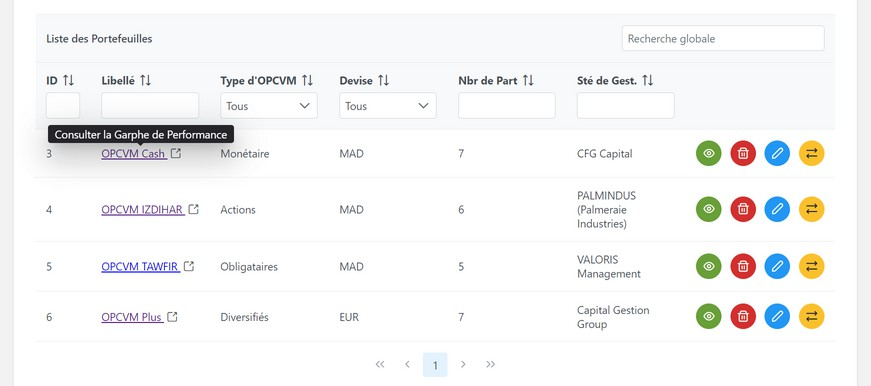
*Liste principale des portefeuilles avec informations détaillées*

### 💰 Portefeuilles avec Transactions
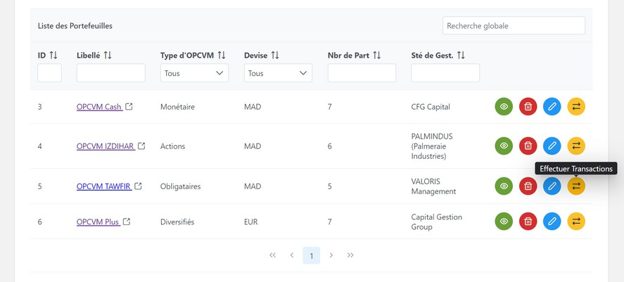
*Liste des portefeuilles avec bouton "Effectuer Transactions"*

### 📈 Graphique de Performance
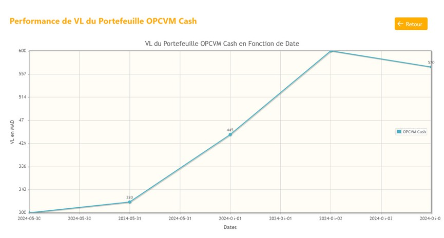
*Graphiques de performance des valeurs liquidatives*

### 🏢 Portefeuilles par Société
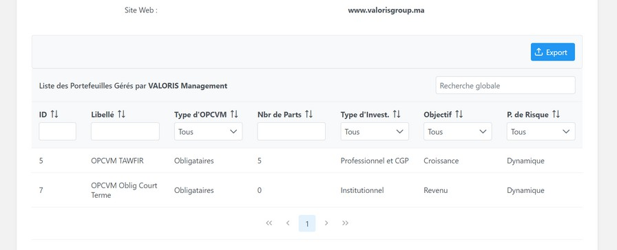
*Portefeuilles gérés par une société de gestion spécifique*

### 📋 Liste des Clients
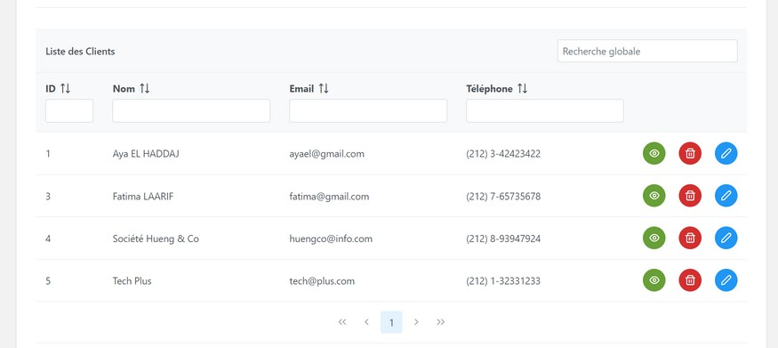
*Tableau de liste des clients avec actions (voir, modifier, supprimer)*

### 👤 Détails Client
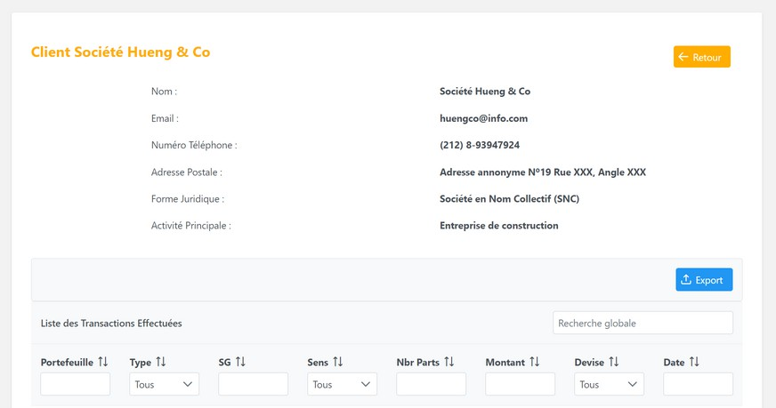
*Page de détail d'un client avec ses informations personnelles et transactions*

### 📊 Historique Client
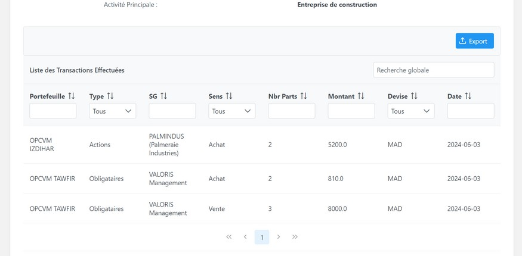
*Historique des transactions d'un client*

### 📈 Gestion des Cours
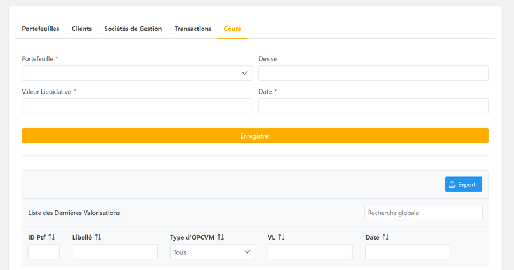
*Interface de gestion des cours (valeurs liquidatives)*

### 📊 Sélection de Portefeuille
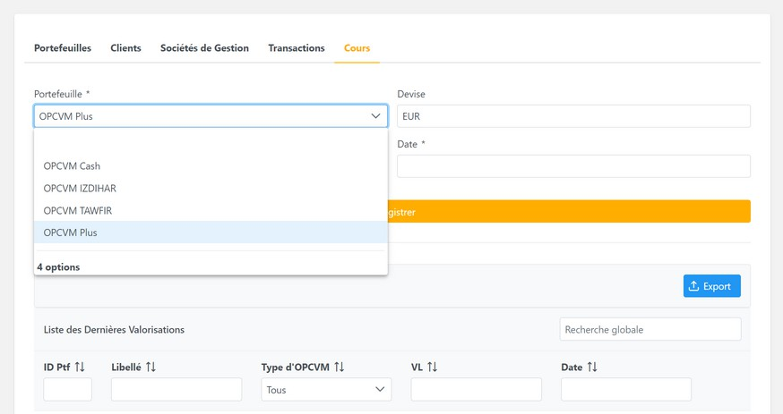
*Sélection de portefeuille pour saisie des cours*

### 💹 Valorisations
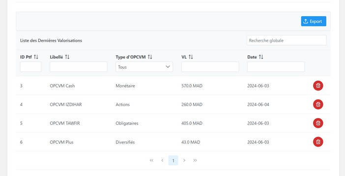
*Tableau des dernières valorisations par portefeuille*

### 🏢 Création Société de Gestion
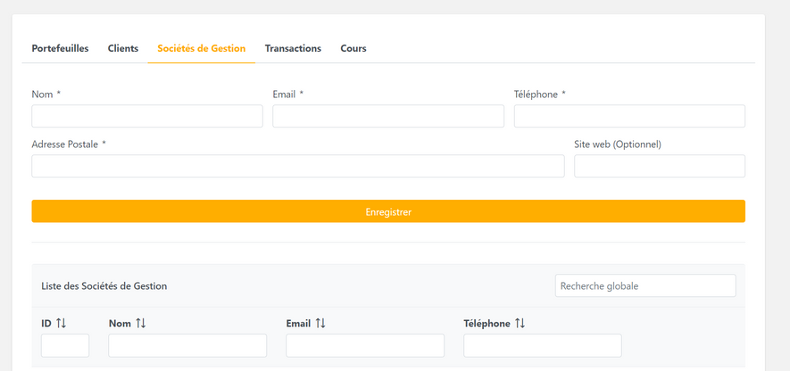
*Formulaire de création de société de gestion*

### 🏢 Détail Société de Gestion
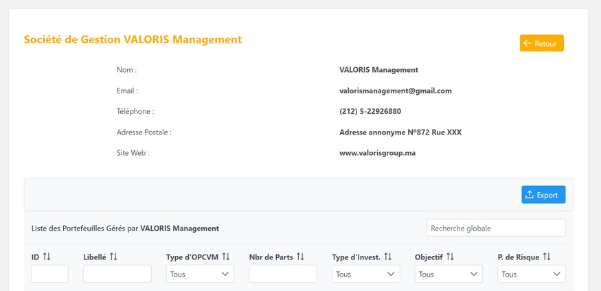
*Page de détail d'une société de gestion*

### 🏢 Sociétés de Gestion
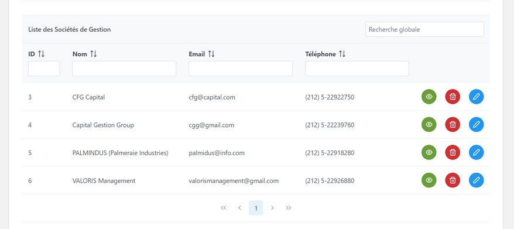
*Liste des sociétés de gestion*

### 🔄 Vue Globale des Transactions

*Vue globale de toutes les transactions*

### ✏️ Formulaire de Transaction
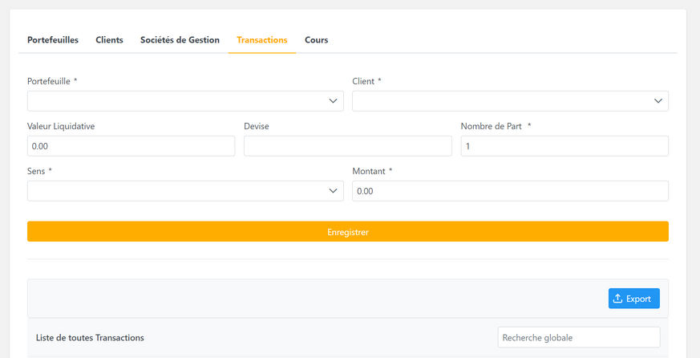
*Formulaire de transaction vierge*

### ✏️ Transaction avec Sélections
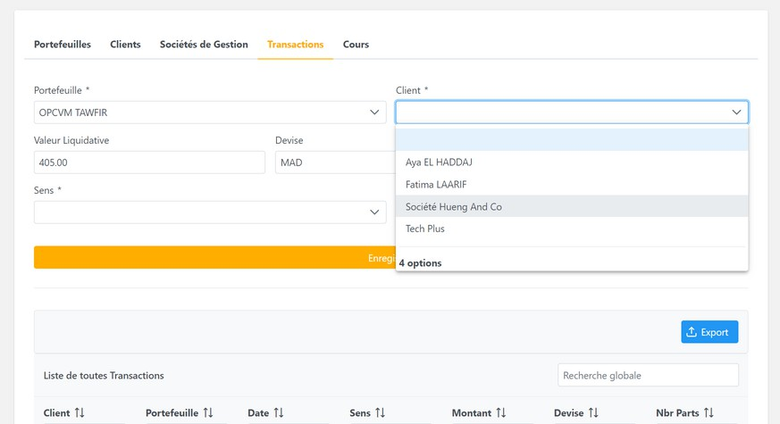
*Formulaire de transaction avec données sélectionnées*

### 💰 Transactions par Portefeuille
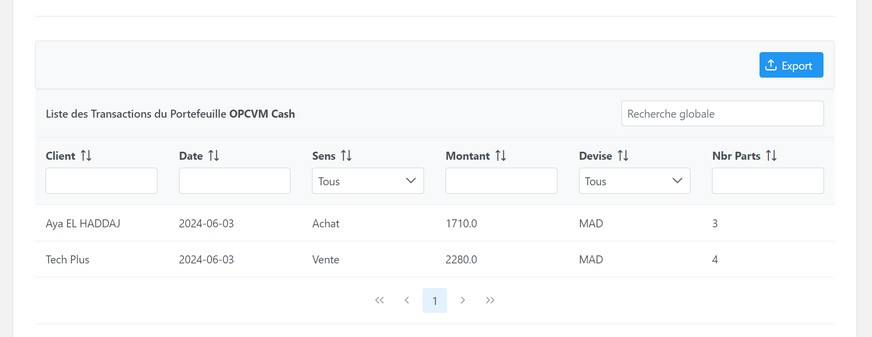
*Transactions d'un portefeuille spécifique (OPCVM Cash)*

</div>

## 👨‍💻 Développement

Projet réalisé par Aya EL HADDAJ, étudiante en Génie Informatique dans le cadre de son stage de 2ème année, encadré par des professionnels du secteur financier.

## 📄 Licence

Ce projet est développé à des fins pédagogiques dans le cadre d'un stage universitaire.
